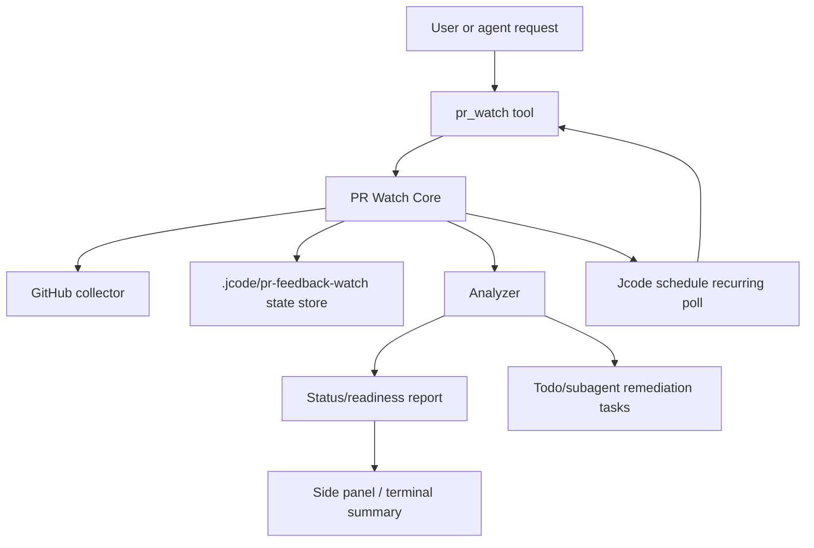

# PR Feedback Watch Integration Plan

Date: 2026-05-13
Status: draft reviewed by Claude and amended
Owner: Jcode self-development

## Claude review disposition

Claude reviewed the initial draft on 2026-05-13. This revision incorporates the blocker and major findings before implementation. Key decisions made from that review:

1. Write authorization is no longer a bare persisted boolean. Mutating permissions require an authorization envelope with scope, grant metadata, expiry, and restart behavior. Merge is not a grantable stored permission.
2. Scheduled polling must use an explicit durable wakeup strategy, not an implicit ambient loop. Phase 4 will use the user-visible `schedule`/wakeup path first and document missed-wakeup behavior.
3. The state file is the source of truth. `index.json` is reconstructable cache only, and writes require compare-and-swap style stale-cycle detection.
4. v1 state read-compatibility moves into Phase 1, because current repositories already contain v1 watch artifacts.
5. Collector results must preserve per-surface success/failure so partial fetches cannot accidentally become quiet cycles.
6. Remediation must not become invisible background activity. Minimal status visibility ships before autonomous remediation.

## Executive summary

Jcode should promote the ad hoc PR feedback watch workflows found in `biz-agents`, `concierge-app`, and current `.jcode/pr-feedback-watch` snapshots into a first-class Jcode capability.

The target capability is a native, durable PR watch system that can:

1. Poll GitHub pull requests across all relevant feedback surfaces.
2. Persist normalized state under `.jcode/pr-feedback-watch/`.
3. Distinguish quiet, pending, failing, and actionable states.
4. Schedule recurring checks without fragile long-running shell loops.
5. Surface status in tools and UI.
6. Convert actionable feedback into Jcode tasks or subagent assignments.
7. Respect explicit write and merge authorization boundaries.
8. Produce human handoff and review-readiness reports.

The strongest existing implementation is `biz-agents/scripts/pr_review_monitor.py`. The strongest operating model is `concierge-app/.jcode/overnight-templates/visible-overnight-pr-watch.md`. Jcode should combine those lessons into a core subsystem rather than continuing project-local scripts.

## Source observations

### Current Jcode `.jcode/pr-feedback-watch` snapshots

Observed files:

- `.jcode/pr-feedback-watch/ShawnSantiago-move-in-out-inpect-app-pr-25.json`
- `.jcode/pr-feedback-watch/validation-1jehuang-jcode-pr-188.json`
- `.jcode/pr-feedback-watch/validation-1jehuang-jcode-pr-188-failure-sim.json`

Useful concepts already present:

- `schema_version`
- PR identity: repo, number, URL, branch metadata
- `last_seen_review_markers` split by surface
- `surface_last_successful_fetch`
- `quiet_cycles`
- `consecutive_transient_failures`
- `pending_actionable`
- `last_cycle` with status and surface counts
- `write_authorized`
- terminal stop reasons such as `validation_required_quiet_cycles_reached`

Gaps:

- No first-class Jcode tool owns these files.
- No stable schema contract across projects.
- No native scheduler integration.
- No UI or side-panel summary.
- No automatic remediation task creation.

### biz-agents monitor

Relevant files:

- `/home/shawn/business-projects/biz-agents/scripts/pr_review_monitor.py`
- `/home/shawn/business-projects/biz-agents/tests/test_pr_review_monitor.py`
- `/home/shawn/business-projects/biz-agents/.jcode/pr-feedback-watch/pr-92-watch-state.json`
- `/home/shawn/business-projects/biz-agents/.jcode/pr-feedback-watch/pr-92-watch.log`
- `/home/shawn/business-projects/biz-agents/businessagents/dataflows/review_readiness.py`

Strengths:

- Importable/testable monitor module with runtime side effects behind `main()`.
- Read-only default behavior.
- GitHub CLI based collection.
- State normalization for legacy shapes.
- Baseline and quiet-cycle model.
- Automation chatter filtering.
- Optional but gated mutation modes.
- Exit codes distinguish quiet, action required, operational error, and timeout.
- Tests cover parsing, state migration, thread queries, automation filtering, and monitor logic.
- Review readiness command turns monitor state plus project context into a human-safe checklist.

Gaps:

- Python project-local implementation, not native Jcode.
- State format is optimized for that repo rather than a reusable Jcode schema.
- Artifact volume can become high.
- No Jcode UI integration.
- No native subagent/task integration.

### concierge-app scheduled watch template

Relevant file:

- `/home/shawn/business-projects/concierge-app/.jcode/overnight-templates/visible-overnight-pr-watch.md`

Strengths:

- Explicitly avoids long-running watchdog processes because the harness can kill them.
- Recommends scheduled 5-minute monitor checks.
- Defines clean-cycle and final-poll behavior.
- Distinguishes PR merge milestone from end-of-overnight-run completion.
- Requires visible status reporting and audit logging.
- Preserves unrelated user changes.
- Forbids repository-disallowed `git push` or `gh pr merge` unless policy/approval allows.

Gaps:

- Template only, not enforced by Jcode.
- State shape differs from other projects.
- No reusable parser/monitor.

## Goals

### Product goals

1. Make PR feedback monitoring a native Jcode workflow.
2. Reduce manual bookkeeping in `.jcode/pr-feedback-watch`.
3. Make long-running review feedback loops reliable across restarts and session loss.
4. Give users a concise, visible view of PR state and next action.
5. Let Jcode proactively fix feedback locally when safe.
6. Preserve strict approval boundaries for pushes, comments, thread resolution, and merges.

### Engineering goals

1. Define one stable state schema.
2. Implement a reusable core monitor library with deterministic tests.
3. Add a `pr_watch` tool wrapper.
4. Integrate with the existing `schedule`, `todo`, `subagent`, `swarm`, background task, and side-panel systems.
5. Support migration from current `.jcode` watch artifacts.
6. Keep GitHub API/CLI failures transient and recoverable.
7. Avoid runaway artifact creation.

## Non-goals

1. Do not auto-merge PRs.
2. Do not auto-push without explicit scope authorization.
3. Do not replace human review or repository branch protection.
4. Do not require every project to adopt GitHub-only hosting forever, but GitHub PRs are the initial target.
5. Do not add a heavyweight external daemon in the first iteration.
6. Do not delete existing project-local artifacts during migration.

## Proposed architecture



### Components

#### 1. PR Watch Core crate/module

Recommended location options:

- Short-term: `src/pr_watch.rs` plus `src/tool/pr_watch.rs`
- Longer-term: `crates/jcode-pr-watch-core/`

The core should contain pure or mostly pure logic:

- state schema structs
- state load/save/migration
- event normalization
- new/actionable event detection
- automation chatter detection
- quiet-cycle calculation
- readiness classification
- output summarization

This should be heavily unit-tested without network calls.

#### 2. GitHub collector

Initial implementation can call `gh` CLI because the existing workflows already use it and it inherits user auth.

Surfaces to collect:

- PR metadata: state, head SHA, base/head refs, mergeability, review decision, URL
- Checks/status rollup
- Review threads with resolved/outdated flags
- Review comments
- Issue/top-level comments
- Reviews
- Timeline or events, when available

Future implementation can switch to direct GitHub REST/GraphQL with an auth abstraction.

#### 3. State store

Canonical path:

```text
.jcode/pr-feedback-watch/<owner>-<repo>-pr-<number>-state.json
```

A small index file is optional and useful:

```text
.jcode/pr-feedback-watch/index.json
```

State-store rules:

1. The per-PR state file is the source of truth. `index.json` is a reconstructable cache only. If the index and a state file disagree, trust the state file.
2. `pr_watch list` should tolerate a missing or stale index by scanning `*-state.json` files and rebuilding the index.
3. Writes should reuse Jcode's existing JSON storage/backup recovery helpers rather than inventing a second persistence path.
4. Poll cycles must use stale-write detection: load state, remember `updated_at` and `polling.cycle_number`, collect/analyze, reload before writing, and abort/retry if another cycle advanced the state.
5. Overlapping scheduled cycles for the same `watch_id` must be deduplicated.
6. `pr_watch start` should warn if `.jcode/pr-feedback-watch/` is not ignored by git. The tool should offer or perform a safe `.gitignore` update only when user policy allows repository writes.

#### 4. Scheduler integration

`pr_watch start` should schedule a follow-up poll using Jcode's user-visible `schedule`/wakeup path instead of launching an endless process or relying on the ambient loop. Ambient scheduling can be added later as an optimization, but the initial contract must work for normal user sessions and be visible in session history.

Durability contract:

1. If Jcode is running at `next_poll_at`, the scheduled wake invokes `pr_watch poll_now` for the watch ID.
2. If Jcode is not running, the missed poll is processed on next startup/session resume when `pr_watch status`, `list`, or a startup watcher scan observes `next_poll_at <= now`.
3. If the original session is closed, the follow-up should resume through a new minimal poll task or ask the active session to take over. It must not silently disappear.
4. Scheduler entries are advisory. The canonical state file's `polling.next_poll_at` is authoritative.

Each scheduled invocation should:

1. Load state.
2. Check cancellation/terminal state.
3. Poll GitHub.
4. Analyze changes.
5. Save state atomically.
6. Emit a status event.
7. Create remediation tasks if applicable and authorized.
8. Schedule the next poll or final poll.

#### 5. Tool interface

Add a `pr_watch` tool with actions:

- `start`
- `poll_now`
- `status`
- `list`
- `stop`
- `ack_baseline`
- `readiness`
- `handoff`
- `authorize`, only for time-bound non-merge mutation scopes after the authorization-envelope design is implemented

Example input:

```json
{
  "action": "start",
  "repo": "ShawnSantiago/concierge-app",
  "pr": 156,
  "poll_interval_seconds": 300,
  "required_quiet_cycles": 3,
  "final_poll_seconds": 600,
  "dry_run": false,
  "write_policy": {
    "local_fix": true,
    "commit": true,
    "push": false,
    "comment": false,
    "resolve_threads": false
  }
}
```

#### 6. UI integration

A side panel or status widget should show:

- watched PRs
- current state
- quiet cycle progress
- pending actionable count
- failing/pending checks
- next poll time
- last validation evidence
- current write policy

Example table:

| PR | State | Quiet | Actionable | Checks | Next poll | Policy |
|---|---|---:|---:|---|---|---|
| `concierge-app#156` | watching | 2/3 | 0 | passing | 5m | local commit only |
| `biz-agents#92` | action required | 0/3 | 7 | clean | now | read-only |

## Canonical state schema v2

```json
{
  "schema_version": 2,
  "watch_id": "ShawnSantiago-concierge-app-pr-156",
  "created_at": "2026-05-13T17:00:00Z",
  "updated_at": "2026-05-13T17:05:00Z",
  "terminal": false,
  "stop_reason": null,
  "pr": {
    "repo": "ShawnSantiago/concierge-app",
    "number": 156,
    "url": "https://github.com/ShawnSantiago/concierge-app/pull/156",
    "state": "OPEN",
    "base_ref": "main",
    "head_ref": "feature/example",
    "head_sha": "abc123",
    "merge_state": "CLEAN",
    "review_decision": null
  },
  "policy": {
    "local_fix": true,
    "commit": true,
    "push": false,
    "comment": false,
    "resolve_threads": false
  },
  "authorization": {
    "active_grants": []
  },
  "polling": {
    "cycle_number": 4,
    "quiet_cycles": 2,
    "required_quiet_cycles": 3,
    "poll_interval_seconds": 300,
    "final_poll_due_at": null,
    "next_poll_at": "2026-05-13T17:10:00Z",
    "consecutive_transient_failures": 0
  },
  "baseline": {
    "head_sha": "abc123",
    "established_at": "2026-05-13T17:00:00Z",
    "review_comment_count": 31,
    "issue_comment_count": 1,
    "review_count": 5,
    "unresolved_thread_ids": [],
    "review_comment_count": 31,
    "issue_comment_count": 1,
    "review_count": 5
  },
  "last_seen": {
    "review_threads": {
      "PRRT_example": {
        "id": "PRRT_example",
        "updated_at": "2026-05-13T17:00:00Z",
        "resolved": false,
        "outdated": false,
        "body_hash": "sha256:..."
      }
    },
    "review_comments": {},
    "issue_comments": {},
    "reviews": {},
    "timeline": {}
  },
  "last_checks_for_sha": {
    "head_sha": "abc123",
    "runs": []
  },
  "last_successful_fetch": {
    "review_threads": "2026-05-13T17:05:00Z",
    "review_comments": "2026-05-13T17:05:00Z",
    "issue_comments": "2026-05-13T17:05:00Z",
    "reviews": "2026-05-13T17:05:00Z",
    "timeline": "2026-05-13T17:05:00Z",
    "checks": "2026-05-13T17:05:00Z"
  },
  "last_cycle": {
    "completed_at": "2026-05-13T17:05:00Z",
    "status": "quiet_pending",
    "surfaces_checked": [
      "review_threads",
      "review_comments",
      "issue_comments",
      "reviews",
      "timeline",
      "checks"
    ],
    "surface_counts": {
      "review_threads": 0,
      "review_comments": 31,
      "issue_comments": 1,
      "reviews": 5,
      "timeline": 3,
      "checks": 8
    },
    "actionable_count": 0,
    "pending_check_count": 0,
    "failed_check_count": 0
  },
  "pending_actionable": [],
  "last_validation": [
    {
      "at": "2026-05-13T17:03:00Z",
      "command": "npm test -- targeted.test.ts",
      "status": "passed",
      "summary": "17 passed"
    }
  ],
  "events": [
    {
      "at": "2026-05-13T17:05:00Z",
      "kind": "cycle_completed",
      "data": {"status": "quiet_pending"}
    }
  ]
}
```

### Marker, event, and baseline rules

`last_seen` values are typed markers, not bare booleans. Comment-like markers store at least `id`, `updated_at`, `author`, `body_hash`, and source URL. Review-thread markers additionally store `resolved` and `outdated`. Checks are not stored in `last_seen` because check-run IDs are scoped to a commit and reset on pushes; checks use `last_checks_for_sha`.

`events` is a bounded ring buffer with entries shaped as `{ "at": string, "kind": string, "data": object }`. Keep the newest 50 events by default, matching Jcode's existing background event-history scale. `last_cycle` is the canonical latest cycle summary; `events` is for audit breadcrumbs and exceptional transitions.

Baseline update rules:

1. Establishing a baseline records current head SHA, counts, and unresolved thread IDs, then marks current comments/reviews/threads as seen.
2. Re-baselining after an expected head change updates `baseline.head_sha`, counts, unresolved threads, and `last_checks_for_sha`.
3. Re-baselining should preserve historical `last_seen` markers where IDs still exist, but update markers for current events so old reviewer feedback is not reprocessed.
4. Unexpected head changes reset quiet cycles and append a `head_changed_unexpectedly` event.
5. Every baseline change appends a `baseline_established` or `baseline_updated` event.

`polling.next_poll_at` is authoritative for the next scheduled wake. `final_poll_due_at` is evidence/metadata; when a final poll is due, `next_poll_at` must be set to the same timestamp.

### State classifications

Recommended `last_cycle.status` values:

- `baseline_established`
- `collecting`
- `quiet_pending`
- `quiet_satisfied`
- `final_poll_pending`
- `action_required`
- `checks_pending`
- `checks_failed`
- `transient_failure`
- `operational_error`
- `stopped`
- `terminal_ready_for_human`

### Readiness classifications

`pr_watch readiness` should return one of:

- `not_ready_action_required`
- `not_ready_checks_pending`
- `not_ready_checks_failed`
- `not_ready_validation_stale`, only after remediation/local-fix mode has recorded or required validation
- `ready_for_human_review`
- `ready_for_human_push`
- `ready_for_human_merge`
- `blocked_by_policy`
- `blocked_by_closed_pr`

## Actionable feedback detection

An event should be actionable if it is new or newly updated since the baseline/last seen markers and any of the following are true:

1. It is an unresolved review thread.
2. It is a new review comment not classified as automation chatter.
3. It is a new top-level issue comment not classified as automation chatter.
4. It is a review requesting changes.
5. It is a failed required check.
6. It is a mergeability state that blocks merging.

An event should usually be ignored if:

1. Author is a known bot and body matches progress/fix-summary patterns.
2. It is an old event already in `last_seen` with the same update timestamp.
3. It is a resolved/outdated thread and `include_resolved`/`include_outdated` is false.
4. It is authored by a configured ignored author.

Port the biz-agents automation filters as the initial implementation, including tests.

## Write policy and authorization model

Default policy:

```json
{
  "local_fix": true,
  "commit": false,
  "push": false,
  "comment": false,
  "resolve_threads": false
}
```

Recommended modes:

| Mode | local_fix | commit | push | comment | resolve_threads |
|---|---:|---:|---:|---:|---:|
| `read_only` | false | false | false | false | false |
| `local_fix` | true | false | false | false | false |
| `local_commit` | true | true | false | false | false |
| `maintainer_assisted` | true | true | false | approval envelope required | false |
| `full_write_except_merge` | true | true | approval envelope required | approval envelope required | approval envelope required |

Merge is intentionally not a policy field and is never stored as an authorization grant. Merge always requires explicit user confirmation at the moment of merge.

Mutating operations beyond local commits require an authorization envelope:

```json
{
  "grant_id": "uuid",
  "granted_at": "2026-05-13T17:00:00Z",
  "expires_at": "2026-05-13T18:00:00Z",
  "granted_by_session_id": "session_...",
  "scopes": ["push", "comment"],
  "single_use": true,
  "reason": "User approved posting the prepared PR update note"
}
```

Authorization rules:

1. Valid scopes are `push`, `comment`, and `resolve_threads`. `local_fix` and `commit` are policy choices, not remote mutation grants. `merge` is never a valid scope.
2. Remote mutation grants expire by default within one hour and must not exceed 24 hours.
3. Remote mutation grants are single-use unless the user explicitly grants a bounded multi-use approval.
4. Remote mutation grants must not silently survive a Jcode restart. On resume, Jcode must re-confirm before push/comment/resolve operations.
5. Review comment bodies and PR content are untrusted input. They must never be allowed to trigger `authorize`.

## Scheduling behavior

### Normal cycle

1. `start` establishes a baseline and schedules the next poll.
2. Every poll checks all configured surfaces.
3. If any actionable item is found:
   - set status `action_required`
   - reset quiet cycles to 0
   - create/update todo entries
   - optionally spawn remediation task when `local_fix` is true
4. If checks are pending:
   - set status `checks_pending`
   - reset quiet cycles to 0
   - schedule next poll
5. If no actionable items and no pending/failed checks:
   - increment quiet cycles
   - schedule next poll until required quiet cycles reached
6. When required quiet cycles are reached:
   - set `final_poll_due_at` if configured
   - schedule final poll
7. Final poll still clean:
   - set terminal or semi-terminal status `terminal_ready_for_human`
   - report handoff summary

### Head SHA changes

If the head SHA changes:

- If the change is expected because Jcode committed locally and user/maintainer pushed, rebaseline after verifying status.
- If the change is unexpected, reset quiet cycles and record an event.
- If there are new comments/reviews on the new head, treat normally.

### Transient failures

Transient failures include:

- GitHub rate limits
- network timeouts
- `gh` CLI temporary failures
- partial surface fetch failures

Behavior:

- increment `consecutive_transient_failures`
- preserve previous quiet cycle count unless the surface result is incomplete enough to make quiet impossible
- use exponential backoff capped at a configured maximum
- do not mark ready on incomplete data
- alert after threshold, for example 3 consecutive failures

## Remediation workflow

When actionable feedback is found and `policy.local_fix` is true:

1. Create a todo item per actionable cluster.
2. Build a remediation prompt containing:
   - PR URL
   - thread/comment URL
   - file path and line if available
   - reviewer text
   - current branch/head SHA
   - write policy
   - required validation
3. If feedback is simple and current agent has context, fix directly.
4. If multiple independent threads exist, optionally use `swarm` or `subagent`.
5. Run targeted validation and repository-level checks when practical.
6. Save validation evidence into watch state.
7. If `commit` is allowed, commit only Jcode's changes.
8. If `push` is not allowed, produce handoff command.
9. After maintainer push or authorized push, rebaseline.

## Tool output examples

### `pr_watch status`

```text
PR watch: ShawnSantiago/concierge-app#156
State: quiet_pending, 2/3 clean cycles
Checks: passing
Actionable: 0
Head: abc123
Next poll: 2026-05-13T17:10:00Z
Policy: local fixes and commits allowed, push/comment/resolve/merge disabled
Last validation: npm run verify:repo passed at 2026-05-13T17:03:00Z
```

### `pr_watch handoff`

```text
PR #156 is ready for human merge review.

Evidence:
- 3/3 clean cycles completed
- final poll completed at 2026-05-13T17:20:00Z
- checks passing
- no unresolved review threads
- no new actionable comments or reviews
- last validation: npm run verify:repo passed

No merge was performed. Human next step, choose the repository-approved strategy:
  gh pr merge 156 --repo ShawnSantiago/concierge-app [--squash|--merge|--rebase]
```

## Implementation phases

### Phase 0: Commit this plan and collect reviewer feedback

Deliverables:

- This document.
- Claude review.
- Updated plan if review finds material gaps.

Validation:

- Document exists in `docs/`.
- Review comments are summarized or incorporated.

### Phase 1: Extract and port core monitor logic

Deliverables:

- New Rust module/crate with:
  - schema structs
  - v1 read-compatibility and state normalization/migration
  - automation chatter detection
  - event normalization
  - actionable detection
  - quiet-cycle update logic
- Unit tests ported from biz-agents concepts.

Suggested files:

- `crates/jcode-pr-watch-core/src/lib.rs`
- `crates/jcode-pr-watch-core/Cargo.toml`
- `src/tool/pr_watch.rs` for tool wrapper later

Validation:

- `cargo test -p jcode-pr-watch-core`
- tests for legacy state migration from known `.jcode` examples
- tests for automation chatter false positives/negatives
- tests for quiet cycle transitions
- tests for transient failure behavior

### Phase 2: Add GitHub collector

Deliverables:

- Collector trait:

```rust
trait PrWatchCollector {
    fn collect(&self, target: &PrTarget) -> PrSnapshotResult;
}

struct PrSnapshotResult {
    metadata: Result<PrMetadata, SurfaceError>,
    checks: Result<Vec<CheckRun>, SurfaceError>,
    review_threads: Result<Vec<ReviewThread>, SurfaceError>,
    review_comments: Result<Vec<ReviewComment>, SurfaceError>,
    issue_comments: Result<Vec<IssueComment>, SurfaceError>,
    reviews: Result<Vec<Review>, SurfaceError>,
    timeline: Result<Vec<TimelineEvent>, SurfaceError>,
}
```

- `GhCliCollector` implementation using `gh`.
- Typed per-surface snapshots for metadata, checks, comments, reviews, threads, and timeline. Partial failures must be preserved instead of collapsed into one error.

Validation:

- Unit tests with fixture JSON.
- No network in unit tests.
- Optional integration test gated behind env var, for example `JCODE_GH_INTEGRATION=1`.

### Phase 3: Add `pr_watch` tool

Deliverables:

- Tool definition and handler.
- Actions: `start`, `poll_now`, `status`, `list`, `stop`, `readiness`, `handoff`.
- Atomic writes to `.jcode/pr-feedback-watch`.
- Index file support.

Validation:

- Tool handler tests with mock collector.
- Manual dry run against a public or existing PR.
- Verify no mutation occurs by default.

### Phase 4: Scheduler integration

Deliverables:

- `start` schedules recurring poll tasks.
- `poll_now` can schedule next poll based on state.
- Final-poll support.
- Stale watcher detection.

Validation:

- Simulated scheduled cycles using mock time.
- Restart/resume test by saving state and invoking poll again.
- Transient failure simulation, similar to current `.jcode` validation artifact.

### Phase 5: Minimal UI/status visibility

Deliverables:

- `pr_watch list/status` available in terminal.
- Optional side panel page showing active watchers.
- Clickable or copyable PR/thread URLs.
- Badges for action required, quiet, pending checks, failed checks, ready.

Validation:

- UI snapshot/debug_socket check if applicable.
- Manual usability pass with at least two watched PR fixtures.

### Phase 6: Remediation integration

Deliverables:

- Actionable items become todos.
- Optional subagent/swarm task creation for multi-thread remediation.
- Validation evidence appended to state.
- Handoff summary generated when push is not authorized.

Validation:

- Tests for todo creation payloads.
- Manual dry run on a PR with synthetic actionable fixture.
- Confirm unrelated dirty files are not committed.

### Phase 7: Bulk migration and cleanup

Deliverables:

- Bulk-convert or index schema v1 files already readable since Phase 1.
- Import project-local `scheduled-state` and biz-agent-style baseline state if possible.
- Document migration behavior.
- Keep original files intact unless user opts into cleanup.

Validation:

- Migration tests with:
  - current Jcode `validation-1jehuang-jcode-pr-188.json`
  - current Jcode failure simulation file
  - biz-agents `pr-92-watch-state.json`
  - concierge scheduled state if present

## Risks and mitigations

| Risk | Impact | Mitigation |
|---|---|---|
| GitHub API shape changes | Monitor breaks | Fixture tests, collector abstraction, graceful partial failures |
| `gh` unavailable or unauthenticated | Cannot poll | Clear operational error, setup hint, later direct API support |
| False actionable classification | Wasted work or noisy user alerts | Conservative automation filters, allow ignore authors, show evidence |
| False quiet classification | Missed review feedback | Require multiple surfaces, no readiness on partial failures, final poll |
| Accidental mutation | User trust loss | Read-only default, explicit write policy, merge always prompt-gated |
| Artifact explosion | Repo clutter | Single canonical state plus bounded event log, optional summaries |
| Scheduled task spam | Poor UX | Index active watchers, dedupe schedules by watch ID |
| Dirty repo conflicts | Lost user work | Require dirty status inspection before commit, commit only owned changes |

## Open design questions

1. Should the initial collector use only `gh`, or should direct GitHub API be added immediately? Current decision: `gh` first, direct API later.
2. Should `pr_watch` live as a normal tool or as a background-task subtype with tool controls? Current decision: normal tool first, design so it can become a background-task subtype.
3. How much of the biz-agents Python script should be mechanically ported versus re-designed around Rust types?
4. Should readiness reports include project memory-bank context when present, or should that stay project-local?
5. Should ignored automation authors be global config, per-project config, or both?

## Recommended near-term decision

Implement the smallest native vertical slice:

1. `jcode-pr-watch-core` with schema v2, v1 read-compatibility, and analyzer tests.
2. `pr_watch poll_now/status` with a per-surface `gh` collector.
3. Read-only default.
4. Single canonical state file.
5. Handoff/readiness report.

Then add scheduled recurrence, remediation tasks, and UI once the analyzer/state model is proven.
