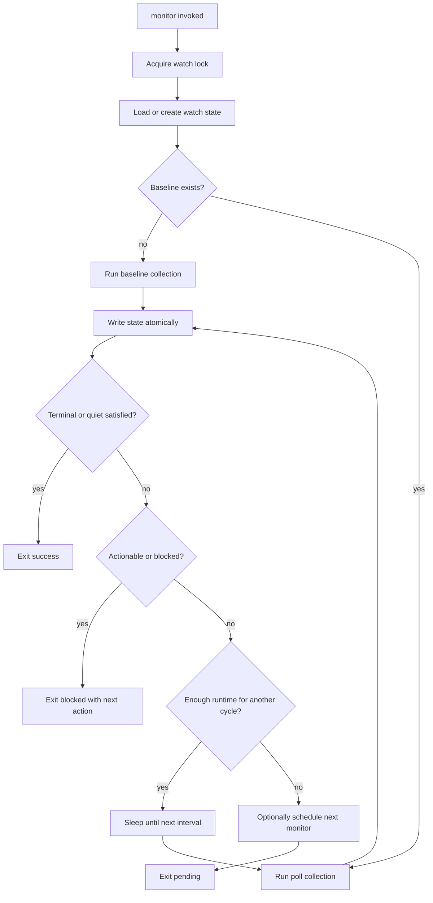

# Native Bounded PR Watch Monitor Design

> Status: Slice B implemented in PR #4 from overnight run `overnight_1778725947328_14110328904992016774`
> Scope: documents the implemented single-cycle monitor plus deferred multi-cycle/stale-lock enhancements.

## Problem

The current `pr_watch` tool supports local state, read-only `poll_now`, baseline acknowledgement, readiness reports, and scheduled follow-up wakeups. Dogfooding showed that purely scheduled follow-up cycles can become stale or missed, while ad-hoc shell/Python poll loops are hard to bound, hard to observe, and easy to time out.

We need a native monitor mode that is:

- bounded by a short max runtime
- read-only by default
- stateful and resumable
- parseably observable from background task output
- safe to re-invoke after timeout or process restart
- conservative around transient collection failures, failed/pending checks, and unresolved threads

## Proposed API

Add one new action to `PrWatchAction`:

```text
pr_watch action="monitor" repo="owner/name" pr=123 \
  watch_id="owner~2fname-pr-123" \
  poll_interval_seconds=300 \
  quiet_cycles_required=3 \
  max_runtime_seconds=600 \
  schedule_next=true \
  target="resume"
```

### New input fields

```rust
#[serde(default)]
quiet_cycles_required: Option<u64>,
#[serde(default)]
max_runtime_seconds: Option<u64>,
```

Keep existing names:

- `repo`
- `pr`
- `watch_id`
- `poll_interval_seconds`
- `schedule_next`
- `target`
- `dry_run`

Do not introduce aliases like `pull_number` or `poll_interval_minutes`.

## Defaults

- `poll_interval_seconds`: current state value, minimum 60
- `quiet_cycles_required`: current state value, default 3
- `max_runtime_seconds`: default 540, maximum 900
- `schedule_next`: false by default for tool call compatibility, but the skill/workflow should pass true for unattended watching

The 540-second default leaves margin under a 600-second background task timeout.

## Lifecycle



## State locking

Use a per-watch lock file next to the state file:

```text
.jcode/pr-feedback-watch/<watch-id>.lock
```

Behavior:

- acquire non-blocking lock
- if lock is held, return a clear `monitor already running` status
- stale lock handling should be conservative: do not break locks unless the owning PID is provably gone or the lock file has an expired heartbeat

A simple initial implementation can avoid stale breaking and just return blocked if locked.

## Monitor loop rules

Each cycle:

1. Re-read state before collection.
2. If terminal, exit without collection.
3. Run `ack_baseline` logic if `last_successful_fetch` is empty.
4. Otherwise run `poll_now` logic.
5. Write state atomically before sleeping or returning.
6. Emit progress:

```text
JCODE_PROGRESS {"current":1,"total":3,"unit":"quiet_cycles","message":"PR watch quiet 1/3; next poll in 300s"}
```

7. If actionable feedback, failed checks, pending checks, or transient collection failure exists, exit with a non-success status and actionable next step. Do not mutate GitHub.
8. If quiet cycles are satisfied, set terminal state and exit success.
9. If the next sleep plus expected collection time would exceed `max_runtime_seconds`, schedule/resume and exit pending.

## Exit categories

Suggested metadata field:

```json
{
  "monitor_status": "quiet_satisfied | pending_next_poll | action_required | checks_pending | checks_failed | transient_failure | already_running | stopped"
}
```

CLI text should include:

- PR URL/target
- head SHA
- surfaces checked
- quiet cycles
- actionable count
- pending/failed check counts
- next poll time
- path to state file

## Scheduling behavior

When `schedule_next=true` and monitor exits before terminal success:

- schedule the same `pr_watch action="monitor"` call, not raw prose-only instructions
- include `watch_id`, `repo`, `pr`, `poll_interval_seconds`, `quiet_cycles_required`, and `max_runtime_seconds`
- target should default to current session resume, or explicit `target="spawn"`

Important: schedule only after state is successfully written.

## Safety policy

Monitor remains read-only:

- no push
- no comments
- no resolving threads
- no merge
- no deleting branches

If actionable feedback appears, monitor exits with `action_required` and points to the feedback. A human or authorized agent then performs edits/pushes outside the monitor action.

## Tests

### Unit tests

1. `monitor_defaults_are_bounded`
   - verifies max runtime default <= 540 and cap <= 900
2. `monitor_exits_when_terminal_state_loaded`
3. `monitor_schedules_only_after_successful_write`
4. `monitor_status_maps_actionable_and_checks`
5. `monitor_lock_prevents_concurrent_runs`

### Integration-style tests with mocked collection

Refactor collection behind a trait or function parameter:

```rust
trait PrWatchCollector {
    async fn collect(&self, target: &PrTarget) -> GhCollection;
}
```

Then test:

1. baseline then two quiet cycles under a short interval
2. unresolved thread exits `action_required`
3. no-checks PR increments quiet cycles
4. pending checks exits `checks_pending`
5. transient metadata failure exits `transient_failure`

## Implementation slices

### Slice A: monitor helpers only ✅ implemented

- add input fields
- add lock helper
- add status enum
- no long loop yet
- tests for parsing/defaults/status

### Slice B: single-cycle monitor ✅ implemented

- monitor performs one baseline/poll cycle and schedules next monitor if requested
- no internal sleep
- this already replaces most prose scheduled wakeups with structured invocations

### Slice C: bounded multi-cycle monitor ⏳ deferred

- add internal sleep loop for short runtimes
- emit `JCODE_PROGRESS`
- stop before timeout margin

Recommended first implementation is Slice B, not C. It provides reliability and structured scheduling without the risk of a long-running tool call.

## Open questions

1. Should monitor be a `pr_watch` action, or a wrapper around `pr_watch poll_now` in the scheduler layer?
2. Should stale lock breaking be implemented immediately or deferred?
3. Should quiet-cycle success auto-stop the watch or require a final explicit `handoff` call?

## Recommendation

Implement **single-cycle structured monitor** first. It is safer than a sleeping loop and directly addresses the observed failure mode: scheduled tasks had too much prose and not enough structured tool intent. Multi-cycle bounded sleeping can come later if needed.
